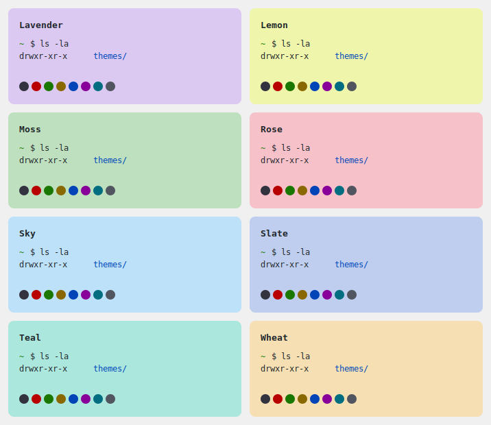

# mac-terminal-themes

A collection of color themes for macOS Terminal.app.

## Themes

- Lavender
- Lemon
- Moss
- Rose
- Sky
- Slate
- Teal
- Wheat

## Installation

Double-click any `.terminal` file to import it into Terminal.app.

Alternatively, go to **Terminal → Settings → Profiles → gear icon → Import**.
